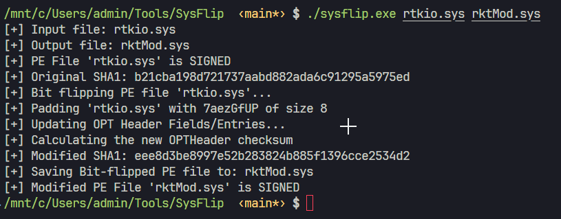
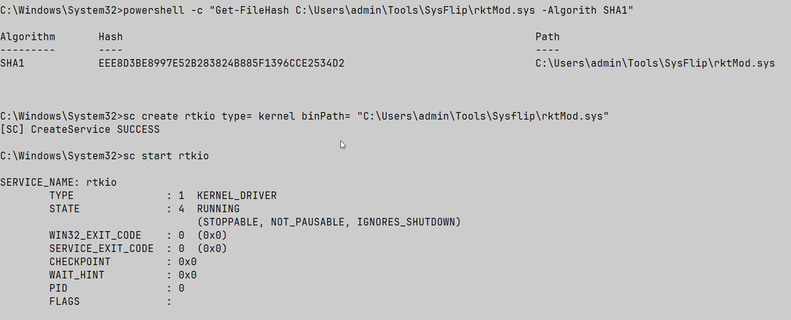

## SysFlip

Tool for modifying hash of signed driver files (sys, exe, dll) without breaking certificate validation by padding the WIN_CERTIFICATE structure with random bytes.

### Usage

```
SysFlip <input_file> <output_file>

Example:
  SysFlip rtkio.sys rtkio_modified.sys
```





### How it works

Embeds random data into the certificate table of authenticode signed PE files. Since certain PE fields are excluded from hash calculation during signing, the file hash changes while the signature remains valid.

### Compilation

```
make
```

### References

* https://github.com/med0x2e/SigFlip

### Credits

Based on SigFlip by med0x2e
